# Массив в JavaScript

Массив - это объект, который содержит значения (любого типа), в частности, не в именованных свойствах /ключах,
а скорее в численно индексированном положении
В JavaScript массив - это упорядоченный список значений. Каждое значение называется элементом, заданным
индексом. ... Во-первых, массив может содержать значения смешанных типов.
Массив - это специальная переменная, которая может содержать более одного значения:
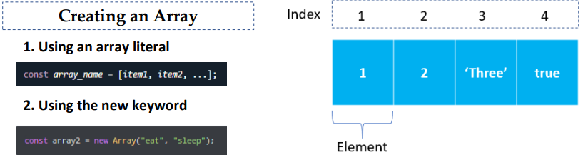

# ИЗМЕНИТЕ ЭЛЕМЕНТЫ В МАССИВЕ

Вы также можете добавлять элементы или изменять их, обратившись к значению индекса
Предположим, массив состоит из двух элементов. Если вы попытаетесь добавить элемент с индексом 3 (четвертый
элемент), третий элемент будет неопределенным. Например,
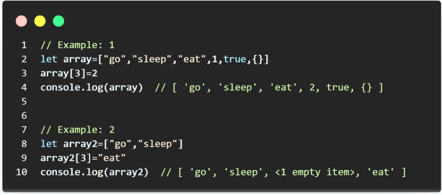

# array methods

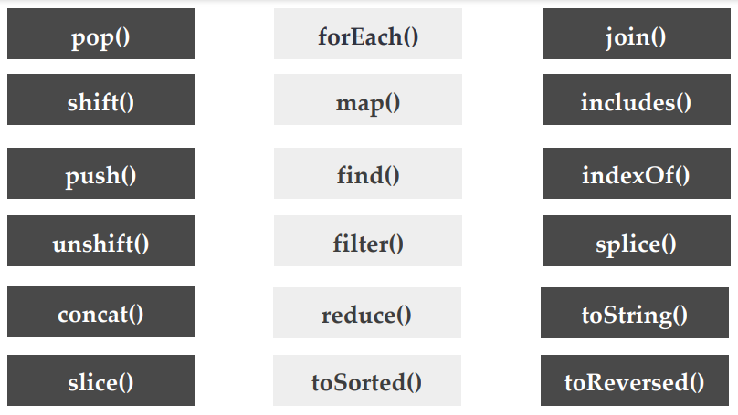

# push

Метод push() добавляет один или несколько элементов в конец массива и возвращает
новую длину массива.
Элемент(ы) для добавления в конец массива.
Синтаксис: push(element0, element1, /_ ... ,_/ elementN)
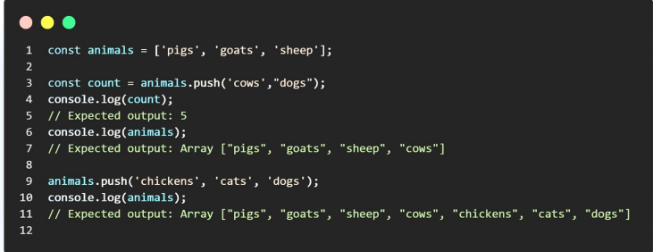

# pop

Метод pop() удаляет последний элемент из массива и возвращает этот элемент.
Этот метод изменяет длину массива.
Синтаксис: pop()
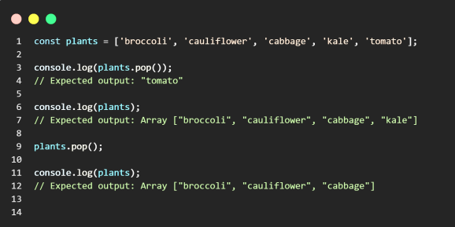

# unshift

Метод unshift() добавляет один или несколько элементов в начало массива и
возвращает новую длину массива.
Синтаксис:
Метод unshift() добавляет один или несколько элементов в начало массива и
возвращает новую длину массива.
отменить сдвиг(элемент0, элемент1, /_ ... ,_/ элементN)
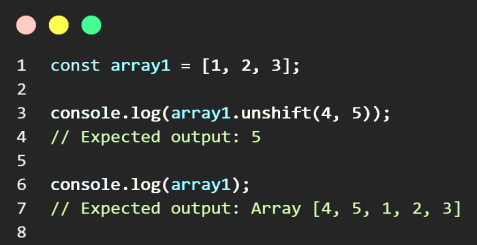

# shift

Метод pop() удаляет последний элемент из массива и возвращает этот элемент.
Этот метод изменяет длину массива.
Синтаксис: shift()
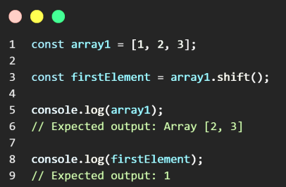

# toString

Метод toString() возвращает строку, представляющую указанный массив и его
элементы.
Строка, представляющая элементы массива.
Синтаксис: toString()
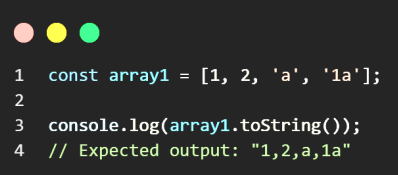

# Методы массива JavaScript

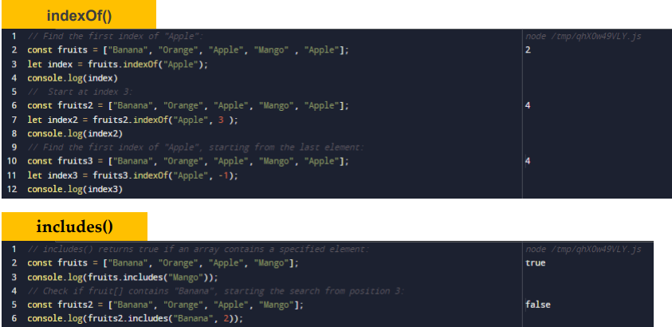

# Методы массива JavaScript

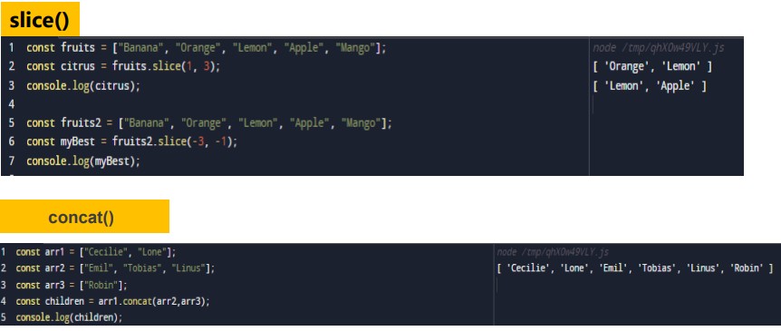

# Методы массива JavaScript

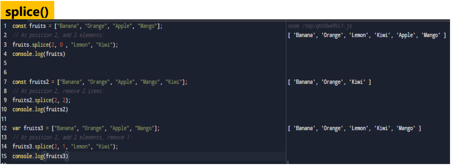
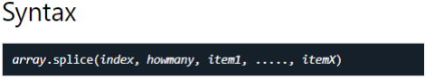

<!-- # Обратные вызовы методов массива JavaScript -->
<!-- 
# map()

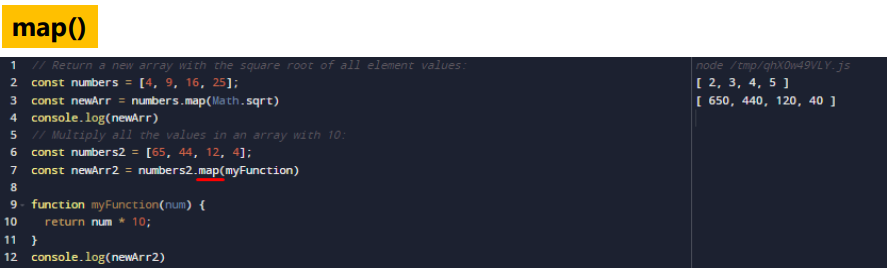

# foreach()

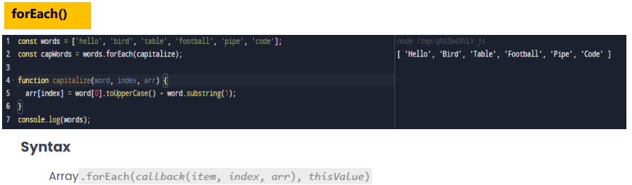

# find()

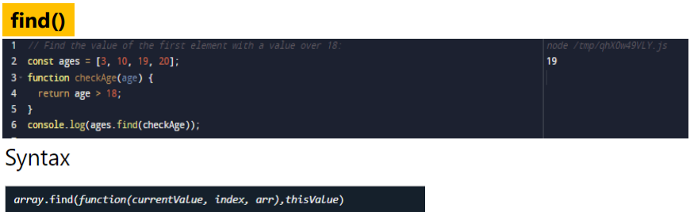

# Метод фильтрации

Метод filter() создает неглубокую копию части заданного массива, отфильтрованную
только до элементов из заданного массива, которые проходят тест, реализованный предоставленной
функцией.
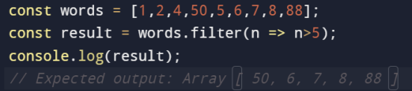

# Method reduce

Метод reduce() выполняет предоставленную пользователем функцию обратного вызова "reducer" для каждого элемента
массива по порядку, передавая возвращаемое значение из вычисления для предыдущего
элемента. Конечным результатом запуска редуктора по всем элементам массива является одно
значение.
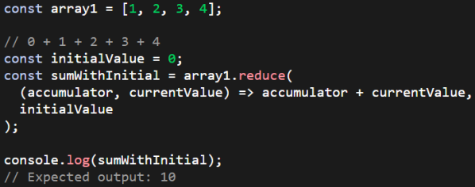

# Method toSorted

Метод to Sorted() экземпляров массива является копирующей версией метода sort().
Он возвращает новый массив с элементами, отсортированными в порядке возрастания.
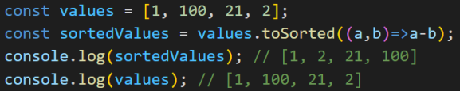 -->
